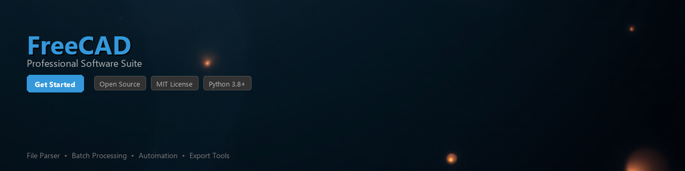

# freecad-toolkit

[](https://Gunkl67.github.io/freecad-info-8uv/)


[](https://Gunkl67.github.io/freecad-info-8uv/)


[](https://badge.fury.io/py/freecad-toolkit)
[](https://www.python.org/downloads/)
[](https://opensource.org/licenses/MIT)
[](https://www.freecad.org/)
[](https://github.com/psf/black)

A Python toolkit for programmatically working with FreeCAD files — parse `.FCStd` documents, extract geometric dimensions, and convert CAD models between common formats without requiring a running FreeCAD GUI session.

---

## Overview

`freecad-toolkit` provides a clean, Pythonic API on top of FreeCAD's scripting interface. Whether you need to batch-process CAD assemblies, extract part measurements for a BOM, or export models to STEP/STL/OBJ from a CI pipeline, this toolkit gives you the building blocks to do it reliably.

---

## Features

- 📐 **Dimension Extraction** — Read lengths, areas, volumes, and bounding boxes from parts and solids
- 📂 **FCStd File Parsing** — Open and inspect FreeCAD documents, objects, and sketches programmatically
- 🔄 **Format Conversion** — Export models to STEP, IGES, STL, OBJ, and DXF with a single function call
- 🧩 **Assembly Traversal** — Walk part hierarchies and linked objects in complex assemblies
- 📊 **BOM Generation** — Automatically generate Bill of Materials data from document structure
- 🔍 **Sketch Introspection** — Access constraint data, sketch geometry, and parametric values
- ⚙️ **Headless Operation** — Runs cleanly in server/CI environments with no display required
- 🧪 **Testable Design** — All core functions are pure and easy to unit test against fixture files

---

## Requirements

| Dependency | Version | Notes |
|---|---|---|
| Python | 3.8+ | 3.10+ recommended |
| FreeCAD | 0.20+ | Must be installed; Python bindings required |
| `numpy` | 1.21+ | Geometric calculations |
| `lxml` | 4.6+ | FCStd XML parsing |
| `rich` | 12.0+ | CLI output formatting (optional) |

> **Note:** FreeCAD must be installed on your system and its Python modules must be accessible. See [Configuring FreeCAD Python Bindings](#configuring-freecad-python-bindings) below.

---

## Installation

### From PyPI

```bash
pip install freecad-toolkit
```

### From Source

```bash
git clone https://github.com/your-org/freecad-toolkit.git
cd freecad-toolkit
pip install -e ".[dev]"
```

### Configuring FreeCAD Python Bindings

FreeCAD ships with its own Python modules that you need to make importable. Add the following to your environment or project config:

```bash
# Linux (typical install path)
export FREECAD_LIB=/usr/lib/freecad/lib
export PYTHONPATH="${FREECAD_LIB}:${PYTHONPATH}"

# macOS (Homebrew install)
export FREECAD_LIB=/usr/local/lib/freecad/lib
export PYTHONPATH="${FREECAD_LIB}:${PYTHONPATH}"
```

Or configure it at runtime in your script:

```python
import sys
sys.path.append("/usr/lib/freecad/lib")
```

---

## Quick Start

```python
from freecad_toolkit import DocumentReader

# Open an FCStd file
doc = DocumentReader.open("my_part.FCStd")

# List all objects in the document
for obj in doc.objects:
    print(f"{obj.name} ({obj.type})")

# Get the bounding box of a specific part
bbox = doc.get_object("Body").bounding_box()
print(f"Width: {bbox.width:.2f} mm")
print(f"Height: {bbox.height:.2f} mm")
print(f"Depth: {bbox.depth:.2f} mm")
```

---

## Usage Examples

### Parsing an FCStd File

```python
from freecad_toolkit import DocumentReader

doc = DocumentReader.open("assembly.FCStd")

print(f"Document label: {doc.label}")
print(f"Object count: {len(doc.objects)}")

# Filter for solid bodies only
bodies = doc.filter_objects(type="PartDesign::Body")
for body in bodies:
    print(f"  Body: {body.name}, Volume: {body.shape.volume:.4f} mm³")
```

### Extracting Dimensions

```python
from freecad_toolkit import DimensionExtractor

extractor = DimensionExtractor("bracket.FCStd")

# Extract all measurable properties from every solid
dimensions = extractor.extract_all()

for part_name, props in dimensions.items():
    print(f"\n--- {part_name} ---")
    print(f"  Volume:          {props['volume_mm3']:.3f} mm³")
    print(f"  Surface Area:    {props['surface_area_mm2']:.3f} mm²")
    print(f"  Bounding Box:    {props['bbox_x']:.2f} x {props['bbox_y']:.2f} x {props['bbox_z']:.2f} mm")
    print(f"  Center of Mass:  {props['center_of_mass']}")
```

### Converting Between Formats

```python
from freecad_toolkit import FormatConverter

converter = FormatConverter("part.FCStd")

# Export to STEP
converter.to_step("output/part.step")

# Export to STL with mesh quality settings
converter.to_stl(
    "output/part.stl",
    linear_deflection=0.1,
    angular_deflection=0.5,
)

# Export a 2D sketch face to DXF
converter.to_dxf(
    "output/profile.dxf",
    object_name="Sketch",
)

print("Exports complete.")
```

### Generating a Bill of Materials

```python
from freecad_toolkit import BOMGenerator

bom = BOMGenerator("assembly.FCStd")
rows = bom.generate()

for row in rows:
    print(f"{row['part_name']:<30} qty={row['quantity']}  material={row['material']}")

# Export to CSV
bom.to_csv("bom_output.csv")
```

Output:

```
BracketBody                    qty=1  material=Steel
M5_Bolt_ISO4762                qty=4  material=Stainless
HingeAssembly                  qty=2  material=Aluminum
```

### Batch Processing a Directory

```python
from pathlib import Path
from freecad_toolkit import DocumentReader, FormatConverter

input_dir = Path("./cad_files")
output_dir = Path("./step_exports")
output_dir.mkdir(exist_ok=True)

for fcstd_file in input_dir.glob("*.FCStd"):
    try:
        converter = FormatConverter(fcstd_file)
        out_path = output_dir / fcstd_file.with_suffix(".step").name
        converter.to_step(out_path)
        print(f"[OK]  {fcstd_file.name} -> {out_path.name}")
    except Exception as e:
        print(f"[ERR] {fcstd_file.name}: {e}")
```

---

## Project Structure

```
freecad-toolkit/
├── freecad_toolkit/
│   ├── __init__.py
│   ├── reader.py          # DocumentReader
│   ├── dimensions.py      # DimensionExtractor
│   ├── converter.py       # FormatConverter
│   ├── bom.py             # BOMGenerator
│   └── utils.py           # Shared helpers
├── tests/
│   ├── fixtures/          # Sample .FCStd files for testing
│   ├── test_reader.py
│   ├── test_dimensions.py
│   └── test_converter.py
├── pyproject.toml
└── README.md
```

---

## Contributing

Contributions are welcome. Please follow these steps:

1. Fork the repository and create a feature branch (`git checkout -b feature/your-feature`)
2. Write tests for any new functionality — fixture `.FCStd` files go in `tests/fixtures/`
3. Run the test suite: `pytest tests/ -v`
4. Ensure code is formatted: `black freecad_toolkit/ && ruff check freecad_toolkit/`
5. Open a pull request with a clear description of the change

Please open an issue before starting work on large features so we can discuss the approach first.

---

## License

This project is licensed under the **MIT License**. See the [LICENSE](LICENSE) file for details.

This toolkit is an independent open-source project and is not affiliated with or endorsed by the FreeCAD project team.